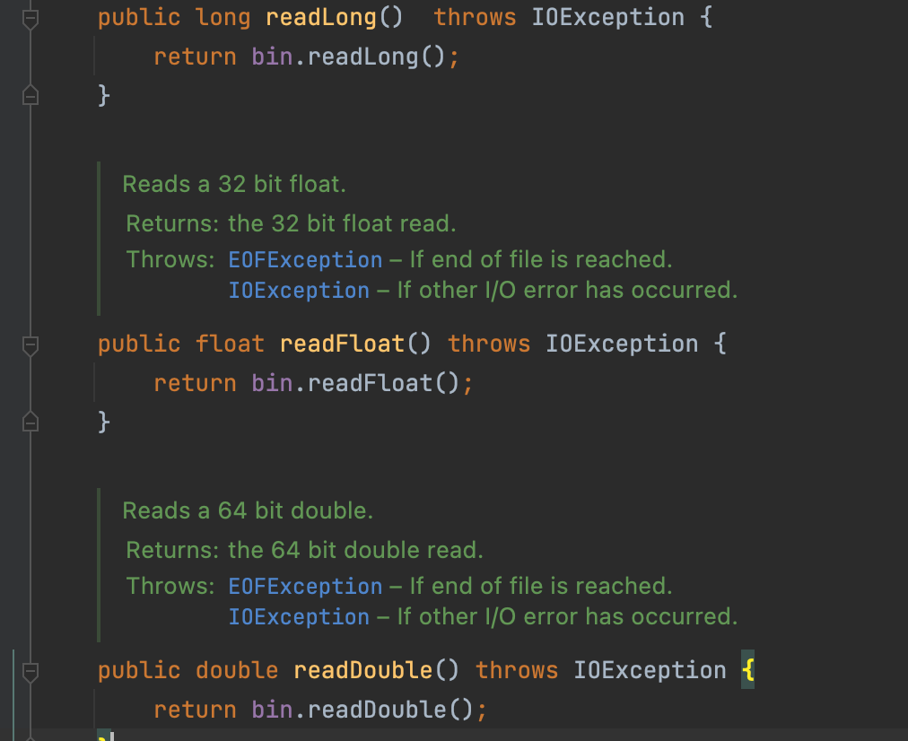

# Item52

# 다중정의(overloading)는 신중히 사용하라

```java
public static String classify(Set<?> s){
    return "set";
}

public static String classify(List<?> list){
    return "list";
}

public static String classify(Collection<?> collection){
    return "else";
}

public static void main(String[] args) {
    Collection<?>[] collections = {
            new HashSet<String>(),
            new ArrayList<BigInteger>(),
            new HashMap<String ,String >().values()
    };

    for(Collection<?> c : collections){
        System.out.println(classify(c));
    }
}
```

위 코드에서 각 for문을 돌면서 원소들을 classify() 에 넣어서 return 값을 출력한다. set, list, else 가 출력될 것 같지만 else 만 세번 출력된다.

오버로딩의 경우에는 세 메서드 중 어느것을 호출할지를 compile 타임에 정하게 된다. for 문 안의 c는 컴파일타임에는 항상 Collection 타입이기 때문에 else만 3번 출력된다.

런타임에서는 다른 타입이 들어오지만, 이미 세번째 메서드를 호출하도록 컴파일 되기 때문에 영향을 주지 못한다.

### overriding 메서드는 동적으로 선택되고, overloading 메서드는 정적으로 선택된다.

```csharp
static class Coffee{
    String name() {return "coffee";}
}

static class Latte extends Coffee{
    @Override
    String name() {
        return "latte";
    }
}

static class Americano extends Coffee{
    @Override
    String name() {
        return "ame ame ame ame";
    }
}

public static void main(String[] args) {
    List<Coffee> coffeeList = List.of(new Coffee(), new Americano(), new Latte());
    for(Coffee coffee : coffeeList){
        System.out.println(coffee.name());
    }
}
```

for 문에서의 컴파일 타입이 Coffee 이지만 런타임에서는 해당 클래스의 overriding 된 메서드를 사용한다
—> 동적 선택

Overloading 된 메서드들은 런타임이 아닌 컴파일 타임의 타입에서 결정된다
—> 정적 선택

### 그럼 Overloading 된 메서드는 런타임 결정을 어케하나?

```java
public static String classify2(Collection<?> c){
    return c instanceof Set ? "set" : c instanceof  List ? "list" : "else";
}
```

런타임에서 결정 못한다…. 그냥 이렇게 내부적으로 type check를 해주어야 한다.

런타임에서 상위 클래스 타입을 이용해서는 하위 클래스의 오버로딩 된 메서드를 사용 할 수 없다. 런타임에서는 처음부터 하위클래스의 타입을 이용해서 overloading 된 메서드를 사용하도록 하자.

### 웬만하면 매개변수 수가 같은 overloading 메서드는 만들지 말자

다중정의는 혼란을 줄 수 있기 때문에 안전하고 보수적으로 하는게 좋을 수도 있다. 매개변수 수가 다르면 애초에 여러 메서드 중 뭘 선택해야할지 혼란이 없다.

### 다중정의 말고 다른 방식을 사용하는법



ObjectOutputStream 클래스

위처럼 동일한 작업을 하는 메서드를 type별로 overloading 하지말고 메서드 이름을 다르게 설정해주자. 가독성도 좋고 오류가 날 일도 없다.

생성자의 경우 이름을 다르게 지을 수 없지만 정적팩토리를 사용하면 쉽게 해결된다. 근데 뭐 생성자는 하위클래스에서 재정의 못하니깐….

### 매개변수 갯수가 같더라도 타입이 다르면 안전하다

매개변수 수가 같더라도 그 중 하나의 매개변수가 근본적으로 다르다면 (형변환 불가) 런타임에서 어느 메서드를 쓸 지 결정할 수 있다.

### 혼란을 주는 예외케이스 (Autoboxing)

```java
public class SetLIst {

    public static void main(String[] args) {
        List<Integer> list1 = new ArrayList<>();
        List<Integer> list2 = new ArrayList<>();
        for(int i=-3; i<3; i++){
            list1.add(i);
            list2.add(i);
        }

        for(int i=0; i<3; i++){
            list1.remove(i);
            list2.remove((Integer) i);
        }
        System.out.println(list1);
        System.out.println(list2);
    }
}
```

출력 : 

[-2, 0, 2]
[-3, -2, -1]

List 인터페이스에서는 remove(int i) 와 remove(Object i) 를 다중 정의했다. 자바4 이전에는 두 타입이 근본적으로 달라서 문제가 없었지만 제네릭과 autoboxing이 등장하면서 근본이 다르지 않게 되었다. 이처럼 다중정의 가 혼란을 가져올 수 있으니 주의를 기울여야 한다.

### 메서드 다중정의 시 서로 다른 함수형 인터페이스는 같은 매개변수 위치에 받지 말자


exec.submit의 경우 overloading 된 메서드이고

sout의 경우 여러 타입을 받을 수 있도록 다중 정의되어있다.


양쪽 다 어느메서드를 사용할 지 모르기때문에 compile시점에서 에러를 뱉는다.

### 근본이 다른 클래스란?

Object 외의 클래스와  배열타입

Serializable/Clonable을 제외한 interface와 배열타입

String 과 Throwabe

이런 클래스들은 관련이 없고, 근본이 다르다고 한다. 양쪽은 서로 형변환도 하지못하고, 어떤 객체도 두 클래스의 공통 인스턴스가 될 수 없다. 이른 근본이 다른 클래스들로 overloading 하는것이 바람직하다

### String 관련 클래스

String은 contentEquals(StringBuffer) 라는 메서드를 가지고 있다. 그런데 StringBuffer, StrinBuilder 등 String 관련 클래스를 하나로 묶기 위해 CharSequence가 등장했고, 이에 따라 String이 기존에 가지고 있던 contentEquals(StringBuffer) 외에도 contentEquals(CharSequence)가 다중 정의되어있다.

물론 동일한 기능을 하고 완전히 같은 작업을 수행해주어서 해로울 건 없다. 기능이 똑같다면 위에 말한 제약들을 굳이 신경쓰지 않아도 된다.

대신 이런 경우에는 더 특수한 메서드에서 더 일반적인 메서드로 일을 넘기자 (forwading 해서 떠넘기자)


더 특수한 StringBuffer가 일반적인 CharSequence로 포워딩한다