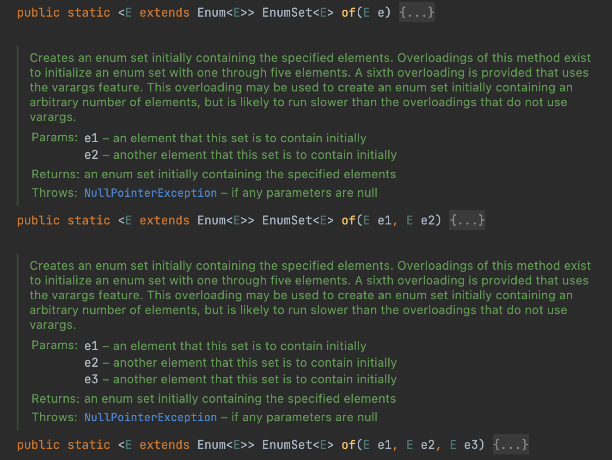

# Item53

# 가변인수는 신중히 사용하라

### 가변 인수란?

method에서 인수 개수가 일정하지 않을때, 0~n 개의 인수를 받을 수 있도록 설정하는 매개변수를 말한다.

```java
public void method1(int... a){
    if (a.length == 0) {
        throw new InvalidParameterException("need parameters");
    }
}
```

위처럼 method 에 들어올 매개변수의 갯수를 확정할 수 없을때, array형태로 받아서 로직을 태울 수 있게한다.

가변인수를 설정할 때는 0개의 인수도 받을 수 있기 때문에, 런타임에서 오류가 날 수 있다.

위처럼 0개인 경우를 method 내부에서 분기쳐서 해결하는것은 좋지 못하다. 컴파일 타임에서 잡는것이 더 나으며, 코드도 지저분하다.

아래처럼 첫번째 인수를 강제로 받도록 해서 0개인 경우는 컴파일도 되지 못하도록 하는편이 낫다.

```java
public void method2(int firstParam, int... remainedParam){
    //custom logic
}
```

### 성능에 민감한 상황이면 overloading 하자

가변인수 메서드는 호출될때마다 배열을 하나 할당하고 초기화한다. 성능에 민감하면 가변인수 대신 필요한 만큼 method를 오버라이딩 하자.

```java
public void method3(int firstParam){}
public void method4(int firstParam, int secondParam){}
public void method5(int firstParam, int secondParam, int thirdParam){}
```

EnumSet의 경우 위처럼 오버로딩을 통해 구현되어있다.



EnumSet은 성능을 중요시 여기기 때문에 (enum 필드들 자체도 비트필드를 사용해서 성능을 높인다) 위와 같은 overloading 방식이 적합하다.