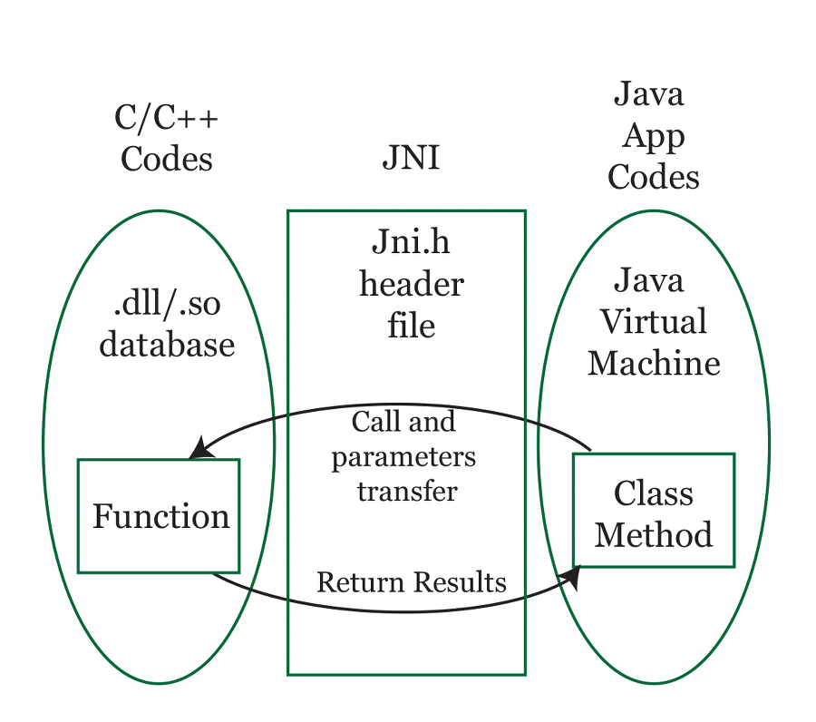

# Item66

# 네이티브 메서드는 신중히 사용하라.

### 네이티브 메서드란?

c 또는 c++ 처럼 네이티브 프로그래밍 언어로 작성한 메서드이다. 이미 해당 언어로 구현된 메서드를 자바 언어로 다시 구현하고 싶지 않거나, 시스템 디바이스에 접근 가능한 고효율 작업이 필요할 때, 혹은 자바로 구현하기에는 성능이 좋지 못한 메서드를 사용하고자 할 때 쓰인다.

플랫폼 특화 기능을 사용하려면 네이티브 메서드를 사용해야한다. 하지만 자바가 발전하면서 하부 플랫폼 (os)의 기능을 흡수하고 있고, 네이티브 메서드의 사용 필요성이 줄어들고 있다.

ex). 자바9 부터 추가된 process API는 os 프로세스에 접근 가능하도록 해준다.

### 성능 개선 목적으로 네이티브 메서드를 사용하지 말자.

jvm이 높은 속도로 발전했기 때문에,  대부분의 작업에서 자바는 다른 플랫폼과 견줄만하다.

ex). java.math 라이브러리는 java 1.1 시절  BigInteger를 C의 라이브러리에 의존했다. 하지만 java 3 때 순수 자바 라이브러리로 다시 구현되면서 원래 네이티브 메서드보다 높은 성능을 보여준다.

다만 java8에서 BigInteger의 큰 수 곱셈 기능의 성능 개선 외에는 이루어지지 않았고, 네이티브 라이브러리는 GNU 다중 정밀 연산에서 개선이 지속되었다. 다중정밀연산이 필요한 경우에는 네이티브 메서드를 고려해도 좋다.

### 네이티브 메서드의 단점

- 안전하지 않으므로 메모리 훼손 오류 위험이 있다.
- 플랫폼을 많이 타기 때문에 이식성이 낮다 (자바는 jvm위에서 뜨니까 이식성이 높다)
- 디버깅이 어렵다.
- GC를 통해 메모리 자동 회수도 안된다. 추적도 불가
- java 코드와 native 코드를 왔다갔다 할 때마다 resource 비용이 크다
- java 코드와 native 코드 간 glue code 를 작성해야하는데, 귀찮다.